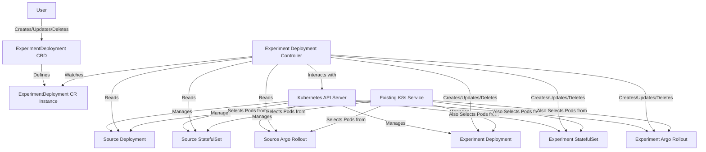

# Implementation Plan: Experiment Deployment Controller

**Version:** 1.1
**Date:** 2025-05-21

**1. Introduction**

This document outlines the implementation plan for the "Experiment Deployment Controller," a Kubernetes controller written in Go. Its purpose is to manage "experiment" versions of existing production workloads (`Deployments`, `StatefulSets`, or `Argo Rollouts`). The controller will watch for `ExperimentDeployment` Custom Resources (CRs). Upon creation or update of an `ExperimentDeployment` CR, the controller will fetch a specified source workload, apply overrides from the CR, and create a new, typically smaller, "experiment" workload. This experiment workload will share the same service as the source and will be cleaned up when the `ExperimentDeployment` CR is deleted.

**2. Goals**

*   Define an `ExperimentDeployment` CRD to specify source workloads and desired overrides.
*   Implement a controller that reconciles `ExperimentDeployment` CRs.
*   Support `Deployment`, `StatefulSet`, and `Argo Rollouts` as source and experiment workload kinds.
*   Enable deep merging of an `overrideSpec` from the CR onto the source workload's spec.
*   Ensure the experiment workload is a "smaller" version (e.g., fewer replicas).
*   Ensure the experiment workload's pods are targeted by the source workload's existing Kubernetes Service.
*   Automatically clean up experiment workloads when the corresponding `ExperimentDeployment` CR is deleted.
*   Provide status feedback on the `ExperimentDeployment` CR.

**3. Main Components**

*   **`ExperimentDeployment` Custom Resource Definition (CRD):**
    *   `apiVersion: experimentcontroller.example.com/v1alpha1`
    *   `kind: ExperimentDeployment`
    *   `spec`:
        *   `sourceRef`:
            *   `kind`: string (Enum: "Deployment", "StatefulSet", "Rollout") - *Required*
            *   `name`: string - Name of the source workload. *Required*
            *   `namespace`: string - Namespace of the source workload. If empty, assumes the same namespace as the `ExperimentDeployment` CR. *Optional*
        *   `replicas`: int32 - Desired number of replicas for the experiment workload. Defaults to 1. For Argo Rollouts, this might translate to a simplified strategy or base replica count. *Optional*
        *   `overrideSpec`: `apiextensions.k8s.io/v1.JSON` - A raw JSON/YAML structure representing the partial spec to be deep-merged onto the source workload's spec. The structure should correspond to the `spec` of the `sourceRef.kind`. *Required*
    *   `status`:
        *   `conditions`: Standard Kubernetes conditions (e.g., `Ready`, `Progressing`).
        *   `experimentResourceRef`:
            *   `kind`: string
            *   `name`: string
            *   `namespace`: string
        *   `observedGeneration`: int64
        *   `readyReplicas`: int32

*   **Reconciler Logic (Controller):**
    *   Watches `ExperimentDeployment` CRs.
    *   Handles create, update, and delete events.
    *   Uses `client-go` for Kubernetes API interactions, potentially leveraging a dynamic client or typed clients for the supported workload kinds.
    *   Implements the reconciliation loop.

*   **Kubernetes API Client Interactions:**
    *   Fetching `ExperimentDeployment` CRs.
    *   Fetching source workloads (`Deployment`, `StatefulSet`, `Rollout`).
    *   Creating, updating, and deleting experiment workloads.
    *   Updating the status of `ExperimentDeployment` CRs.

**4. Key Development Steps**

1.  **Project Setup (Go & Kubebuilder):**
    *   Initialize a new Go project.
    *   Use **Kubebuilder** to scaffold the controller project, including CRD definition and basic controller structure. Kubebuilder is recommended for its simplicity, focus on `controller-runtime`, and close alignment with upstream Kubernetes libraries.
    *   Set up `Makefile` for build, test, and deployment tasks.

2.  **Define `ExperimentDeployment` API (CRD):**
    *   Define the Go types for `ExperimentDeploymentSpec` and `ExperimentDeploymentStatus` as described above.
    *   Generate the CRD manifest using Kubebuilder tools (`make manifests`).
    *   Install the CRD into a development Kubernetes cluster.

3.  **Implement Reconciler Logic - Core Loop:**
    *   Implement the `Reconcile` function in the controller.
    *   Fetch the `ExperimentDeployment` instance.
    *   Handle CR deletion (finalizers might be needed for pre-delete hooks if owner references are not sufficient for all cleanup scenarios, though generally owner refs are preferred).

4.  **Implement Reconciler Logic - Source Workload Fetching:**
    *   Read `sourceRef` from the `ExperimentDeployment` spec.
    *   Based on `sourceRef.kind`, fetch the source workload using the appropriate client (e.g., `apps/v1.Deployment`, `apps/v1.StatefulSet`, `argoproj.io/v1alpha1.Rollout`). A dynamic client with `unstructured.Unstructured` can also be used for generic handling.

5.  **Implement Reconciler Logic - Spec Merging (Override Mechanism):**
    *   Extract the `spec` from the fetched source workload.
    *   Deep merge the `overrideSpec` from the `ExperimentDeployment` CR onto the source workload's spec. (See Section 5 for detailed strategy).

6.  **Implement Reconciler Logic - Experiment Workload Creation/Update:**
    *   Construct the new experiment workload object (of the same `kind` as the source).
        *   **Naming:** Derive a name, e.g., `[source-name]-experiment-[experiment-cr-name-hash-suffix]` or simply `[source-name]-experiment`. Ensure uniqueness.
        *   **Namespace:** Same as the source workload or `ExperimentDeployment` CR.
        *   **Spec:** Use the merged spec.
        *   **Replicas:** Apply the `replicas` value from `ExperimentDeployment.spec.replicas`. For Argo Rollouts, this might involve simplifying its strategy to use this replica count.
        *   **Labels & Annotations:**
            *   Ensure the pod template within the experiment workload's spec has labels that match the *existing Service's selectors* for the source workload.
            *   Add additional, unique labels to distinguish experiment pods (e.g., `experiment-controller.example.com/cr-name: <cr-name>`, `experiment-controller.example.com/role: experiment`).
            *   Copy relevant annotations, potentially adding experiment-specific ones.
        *   **Owner Reference:** Set an owner reference on the experiment workload pointing to the `ExperimentDeployment` CR for automatic garbage collection.
    *   Create the experiment workload if it doesn't exist.
    *   Update it if it exists and the derived spec has changed.

7.  **Implement Reconciler Logic - Status Updates:**
    *   Update the `status` subresource of the `ExperimentDeployment` CR with:
        *   Reference to the created experiment workload.
        *   Readiness status (e.g., number of ready replicas from the experiment workload).
        *   Conditions reflecting the state of reconciliation.

8.  **Testing:**
    *   **Unit Tests:** For individual functions, especially the merge logic and spec transformation.
    *   **Integration Tests:** Using `envtest` (provided by Kubebuilder) to test the controller's interaction with a real Kubernetes API server in a test environment. Test cases should cover:
        *   CR creation, update, deletion for each supported `kind`.
        *   Correct application of overrides.
        *   Correct replica counts.
        *   Service targeting.
        *   Garbage collection.
        *   Status updates.

9.  **Documentation:**
    *   `README.md` with setup, deployment, and usage instructions.
    *   CRD documentation (examples).

10. **Deployment:**
    *   Containerize the controller.
    *   Provide Kubernetes manifests for deploying the controller (Deployment, ServiceAccount, RBAC Roles/RoleBindings).

**5. Considerations for the Override Mechanism (Deep Merge Strategy)**

*   **Structure:** The `overrideSpec` field in the `ExperimentDeployment` CR will be of type `apiextensions.k8s.io/v1.JSON`. This allows users to provide a YAML/JSON snippet that mirrors the structure of the target workload's `spec`.
*   **Data Representation for Merging:**
    *   The source workload's `spec` (e.g., `Deployment.spec`) and the `overrideSpec` from the CR should both be converted to `map[string]interface{}` for the merge operation. This can be achieved by marshalling to JSON and then unmarshalling into a map, or using struct-to-map utilities if starting from typed Go structs. If using `unstructured.Unstructured` for the source, its `Object["spec"]` is already a map.
*   **Core Merge Logic ("Overlay" Approach):**
    *   The `overrideSpec` map is overlaid onto the `sourceSpec` map.
    *   **Primitive Types (string, number, boolean):** Values from `overrideSpec` replace those in `sourceSpec`.
    *   **Nested Maps:** Recursively apply the merge logic.
    *   **Slices/Arrays:** **Replace the entire slice.** If `overrideSpec` provides a slice for a key (e.g., `spec.template.spec.containers`), that entire slice from `overrideSpec` replaces the corresponding slice in `sourceSpec`. This is the most predictable behavior for Kubernetes configurations.
    *   **New Keys:** Keys present in `overrideSpec` but not `sourceSpec` are added.
    *   **Untouched Keys:** Keys in `sourceSpec` but not `overrideSpec` are retained.
*   **Implementation (Go):**
    *   Utilize a robust Go library for deep merging, such as `github.com/imdario/mergo`. Configure it with options like `mergo.WithOverride` (to ensure override values take precedence) and ensure slice handling aligns with the "replace" strategy. Custom transformers or pre/post-processing for slices might be needed if the library's default slice merge isn't a direct replacement.
    *   The merged `map[string]interface{}` result is then converted back to the specific Go struct type of the target workload's spec (e.g., `appsv1.DeploymentSpec`) by marshalling to JSON and unmarshalling into the typed struct.
*   **Kind-Specific Overrides:** While the `overrideSpec` is generic, the controller's logic might need slight awareness of the `kind` when preparing the final merged spec, especially for complex types like Argo Rollouts.
*   **Robustness:** The controller must be robust against malformed `overrideSpec` data.

**6. Lifecycle of the Experiment Deployment**

*   **Creation:**
    1.  User creates an `ExperimentDeployment` CR.
    2.  Controller reconciles, fetches the source workload, applies overrides.
    3.  Controller creates the new experiment workload with an owner reference to the `ExperimentDeployment` CR.
*   **Updates:**
    1.  User updates the `ExperimentDeployment` CR.
    2.  Controller reconciles, re-fetches the source, re-applies new overrides.
    3.  Controller updates the existing experiment workload.
*   **Deletion:**
    1.  User deletes the `ExperimentDeployment` CR.
    2.  Kubernetes garbage collection (due to owner reference) automatically deletes the experiment workload.

**7. Service Integration**

*   **Goal:** The experiment workload's pods must be discoverable via the *same Kubernetes Service* that fronts the source workload.
*   **Mechanism:**
    1.  Inspect `spec.template.metadata.labels` of the source workload.
    2.  When creating the experiment workload, its `spec.template.metadata.labels` will include all labels from the source pod template likely part of the Service's selector.
    3.  Add unique labels to distinguish experiment pods (e.g., `experiment-controller.example.com/is-experiment: "true"`).
*   **Traffic Splitting:** Traffic will be split by the Service based on the number of available pods.
*   **No Service Modification:** The controller will *not* modify the existing Service.

**8. Potential Challenges & Important Design Decisions**

*   **Generic Workload Handling:** Using `unstructured.Unstructured` and a dynamic client is flexible. Typed clients offer safety. A hybrid approach may be optimal.
*   **Argo Rollouts Complexity:** Defining how `overrideSpec` applies to Rollouts and how a "smaller experiment" Rollout is defined (e.g., simplifying its strategy) is key.
*   **Label/Selector Management:** Ensuring correct service selection and unique identification of experiment pods.
*   **Idempotency:** The reconciliation loop must be fully idempotent.
*   **Error Handling & Retries:** Robust error handling for API calls, merge failures, etc.
*   **RBAC Permissions:** The controller will need appropriate RBAC permissions.
*   **Immutable Fields:** The controller must handle immutable fields in workload specs correctly.

**9. Future Considerations (Out of Scope for v1.1)**

*   Support for other workload kinds.
*   More sophisticated strategy modifications for Argo Rollouts experiments.
*   Metrics and alerting.
*   Integration with traffic management solutions (e.g., Istio).
*   Validating webhooks for the `ExperimentDeployment` CRD.

This plan provides a comprehensive outline for developing the Experiment Deployment Controller.